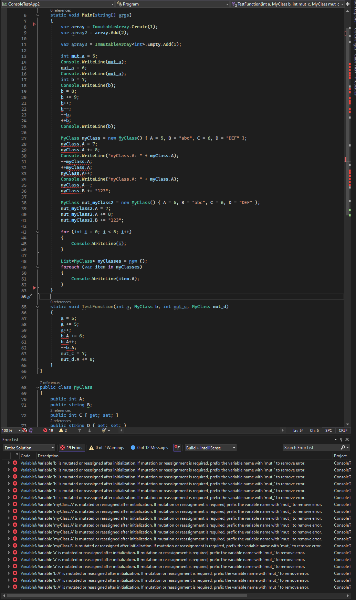

# C# Immutability/Mutability Rosalyn Analyzer
After working with F# and Rust for awhile, it was nice having more strongly enforced immutability upon variables and function arguments. This Rosalyn analyzer was a fun experiment to see if for personal C# projects I could create an analyzer that would help bring some similar'ish warning/error messages to my code if I didn't specify that a variable or function parameter should be mutated but it is altered after initialization in some way. This is a simple analyzer and there are doubtless tons of ways to mutate a variable without the analyzer catching it, but this was mostly just designed as a fun experiment that worked out better than I expected.

The simple way this analyzer works, is if a variable or function argument should be able to be mutated, then the name of the variable should be prefixed with "mut_". This applies to primitive and class types. Using the "mut_" prefix mostly came from how Rust uses "let mut x = 5" for a mutable variable, or F# uses "let mutable x = 5".

In the screenshot below, it shows that if you define a variable or argument without the mut_ prefix, then if you try to mutate the variable or its member properties then you get a compile error. But if the variable or argument has the mut_ prefix, then you can mutate the variable with no error message.



## Adding the analyzer to a project
Currently I haven't placed this analyzer on Nuget as this was just a fun experiment to be used in my personal projects, but if adding it to a project how I currently do it is I just create a "Dlls" folder and place the MutabilityAnalyzer.dll in the folder. Then add this entry to my .csproj file.

```xml
  <ItemGroup>
    <Analyzer Include=".\Dlls\MutabilityAnalyzer.dll" />
  </ItemGroup>

  <ItemGroup>
    <Reference Include="MutabilityAnalyzer">
      <HintPath>Dlls\MutabilityAnalyzer.dll</HintPath>
    </Reference>
  </ItemGroup>
```